# Timely — Fingerprint Attendance System

Sistema de controlo de assiduidade baseado em ESP32 com sensor biométrico óptico. Os utilizadores fazem enroll através do painel web (Laravel) e registam ponto colocando o dedo no sensor. A comunicação com o backend é feita via MQTT (recepção) e HTTPS (envio).

---

## Índice

- [Visão geral](#visão-geral)
- [Arquitectura do sistema](#arquitectura-do-sistema)
- [Hardware](#hardware)
- [Pré-requisitos](#pré-requisitos)
- [Setup inicial](#setup-inicial)
- [Estrutura do projecto](#estrutura-do-projecto)
- [Os três environments](#os-três-environments)
- [Mudar entre environments](#mudar-entre-environments)
- [Compilar e fazer upload](#compilar-e-fazer-upload)
- [Workflow típico](#workflow-típico)
- [Troubleshooting](#troubleshooting)
- [Referências](#referências)

---

## Visão geral

O sistema é composto por três peças que comunicam entre si:

```
┌─────────────┐      MQTT       ┌──────────────┐
│   Laravel   │ ◄──────────────►│    ESP32     │
│  (backend)  │      HTTPS      │  (firmware)  │
└─────────────┘                 └──────────────┘
                                       │
                                       │ UART
                                       ▼
                                ┌──────────────┐
                                │ Sensor AS608 │
                                │  + LCD I2C   │
                                └──────────────┘
```

**O que o ESP32 faz:**
- Recebe pedidos de enroll e delete via MQTT (broker HiveMQ Cloud com TLS)
- Lê impressões digitais com o sensor óptico AS608
- Envia confirmações e registos de ponto via HTTP POST para a API Laravel
- Guarda a associação entre slot do sensor e nome do utilizador localmente (NVS)

**Tipos de operação:**
- **Enroll** — registar uma nova impressão digital num slot específico
- **Scan** — ler impressão digital e registar ponto
- **Delete** — apagar uma impressão digital de um slot

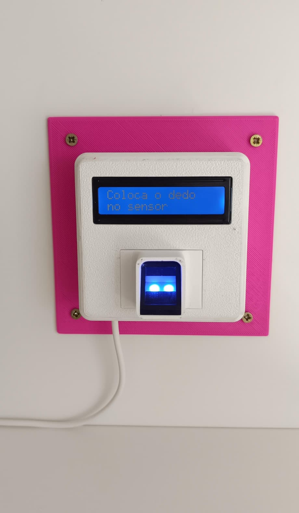

---

## Arquitectura do sistema

O firmware está dividido em módulos independentes, cada um com responsabilidade única:

|         Módulo        |                     Responsabilidade                      |
|-----------------------|-----------------------------------------------------------|
| `wifi_manager`        | Conectar ao WiFi, configurar IP estático, gerir reconexão |
| `mqtt_manager`        | Sessão MQTT/TLS, subscrição de tópicos, callback          |
| `http_manager`        | Pedidos HTTPS para a API Laravel (enroll, ponto, delete)  |
| `fingerprint_manager` | Comunicação UART com o sensor AS608                       |
| `display_manager`     | Controlo do LCD I2C com re-inicialização periódica        |
| `ota_manager`         | Updates OTA via WiFi (ArduinoOTA)                         |
| `user_storage`        | Persistência local de utilizadores em NVS                 |

Os dois firmwares principais (`main_enroll.cpp` e `main_scan.cpp`) orquestram estes módulos. Cada um é compilado num **environment** separado do PlatformIO, gerando binários distintos para a mesma board física consoante o papel que o ESP32 vai desempenhar.

---

## Hardware

|     Componente    |                Modelo              |           Notas          |
|-------------------|------------------------------------|--------------------------|
| Microcontrolador  | JOY-IT SBC-NodeMCU-ESP32-C         | ESP32 com USB-C          |
| Sensor biométrico | Keyestudio MD0622 (AS608, 8 pinos) | Sensor óptico, 300 slots |
| Display           | Keyestudio KS0061 LCD 16x2 I2C     | Endereço 0x27            |

**Ligações principais:**

```
Sensor AS608      ESP32 JOY-IT
─────────────    ──────────────
V+ (vermelho) ─► 3V3
GND (preto)   ─► GND
TX (laranja)  ─► GPIO16 (RX2)
RX (amarelo)  ─► GPIO17 (TX2)

LCD I2C           ESP32 JOY-IT
──────────       ──────────────
VCC ───────────► 5V
GND ───────────► GND
SDA ───────────► GPIO21
SCL ───────────► GPIO22
```

---

## Pré-requisitos

Para configurar o ambiente de desenvolvimento precisas de:

- **VS Code** — [code.visualstudio.com](https://code.visualstudio.com)
- **Git** — para clonar o repositório
- **Extensão PlatformIO IDE** — instala-se dentro do VS Code (próximo passo)
- **Driver CP210x** — normalmente já instalado se já usaste outros ESP32

Não é necessário instalar Arduino IDE, Python, nem nenhum compilador. O PlatformIO trata de tudo internamente.

---

## Setup inicial

### 1. Instalar a extensão PlatformIO IDE

No VS Code, abre o painel de Extensões (`Ctrl+Shift+X`), pesquisa por **PlatformIO IDE** e instala. A instalação demora 2-3 minutos e descarrega o core do PlatformIO automaticamente. Reinicia o VS Code quando pedir.

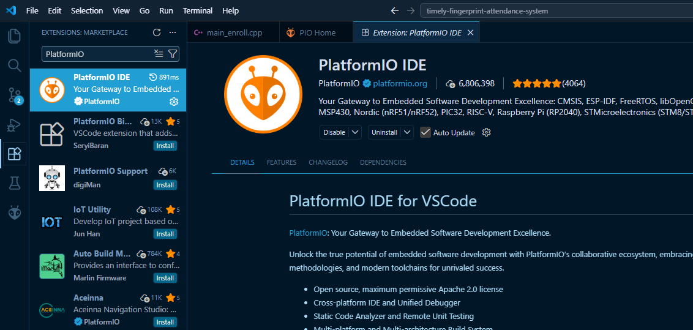

Após reiniciar, deves ver um ícone de formiga (alien) na barra lateral esquerda. Clica nele para abrir o **PIO Home**:

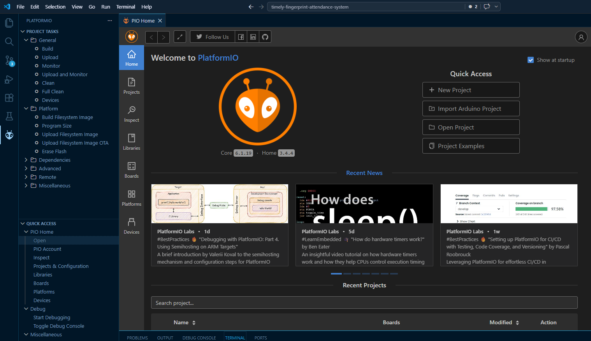

### 2. Clonar o repositório

Abre um terminal e clona o projecto:

```bash
git clone https://github.com/Ramone04/timely-fingerprint-attendance-system.git
cd timely-fingerprint-attendance-system
```

### 3. Abrir o projecto no VS Code

No PIO Home, clica em **Open Project** e selecciona a pasta onde clonaste o repositório. O PlatformIO vai detectar o `platformio.ini` e começar a indexar.

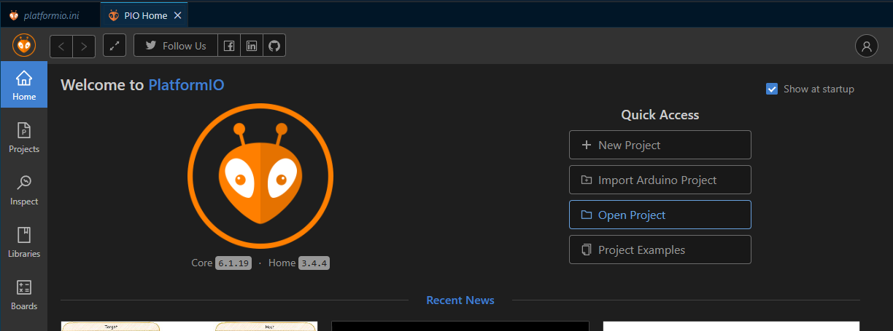

**Na primeira abertura**, o PlatformIO descarrega o toolchain do ESP32 e todas as bibliotecas declaradas no `platformio.ini`. Pode demorar 5-10 minutos. Verás progresso no terminal — espera até terminar antes de continuar.

### 4. Criar o ficheiro `secrets.ini`

As credenciais não estão no repositório (estão no `.gitignore`). Cria o ficheiro `secrets.ini` na raiz do projecto, copiando o `secrets.example.ini`:

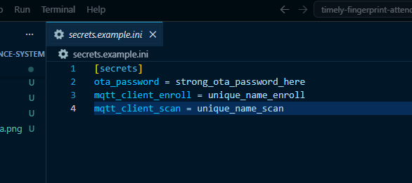

```ini
[secrets]
ota_password = a_password_real_do_ota
mqtt_client_enroll = timely-enroll-prod
mqtt_client_scan = timely-scan-prod
```

**Pede estes valores ao responsável do projecto.**

### 5. Criar o ficheiro `include/config.h`

Tal como o `secrets.ini`, o `config.h` contém credenciais e está no `.gitignore`. Pede ao responsável o `config.h` actualizado e coloca-o em `include/config.h`. Contém as credenciais do WiFi, do broker MQTT e os URLs da API.

---

## Estrutura do projecto

```
timely-fingerprint-attendance-system/
├── .vscode/                    # configurações do VS Code (gerado automaticamente)
├── docs/
│   └── images/                 # screenshots e diagramas
├── examples/                   # sketches de teste isolados (utilitários)
├── Hardware/Models/            # modelos 3D da caixa
├── include/                    # ficheiros .h (interface dos módulos)
│   ├── config.h                # credenciais e constantes (NÃO COMMITAR)
│   ├── certificates.h          # certificados TLS
│   └── *.h                     # interfaces dos módulos
├── lib/                        # bibliotecas locais (não usado neste projecto)
├── src/
│   ├── enroll/main_enroll.cpp  # firmware do dispositivo de enroll
│   ├── scan/main_scan.cpp      # firmware do dispositivo de scan
│   ├── test/main_test.cpp      # firmware para testes experimentais
│   └── modules/                # implementações dos módulos partilhados
│       ├── wifi_manager.cpp
│       ├── mqtt_manager.cpp
│       ├── http_manager.cpp
│       ├── fingerprint_manager.cpp
│       ├── display_manager.cpp
│       ├── ota_manager.cpp
│       └── user_storage.cpp
├── test/                       # testes unitários (placeholder)
├── .gitignore
├── platformio.ini              # configuração de build (FICHEIRO PRINCIPAL)
├── secrets.ini                 # credenciais (NÃO COMMITAR)
├── secrets.example.ini         # template público de credenciais
└── README.md
```

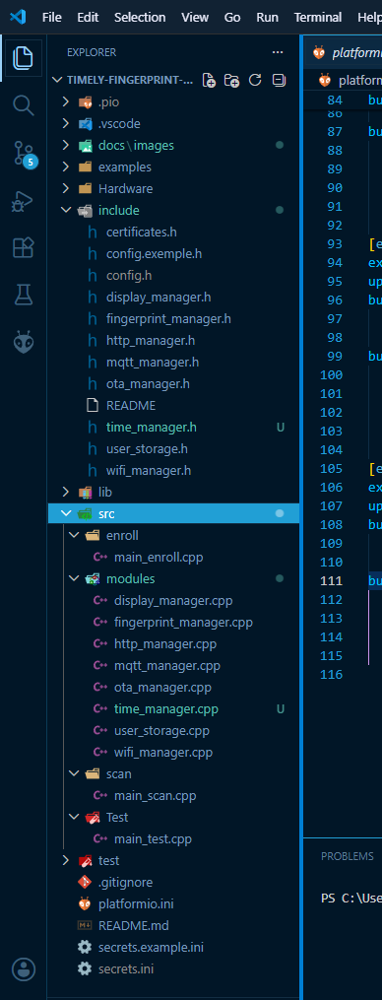

---

## Os três environments

O ficheiro `platformio.ini` define vários "environments" — cada um produz um binário diferente para a mesma board física. Cada environment compila um subconjunto específico do código.

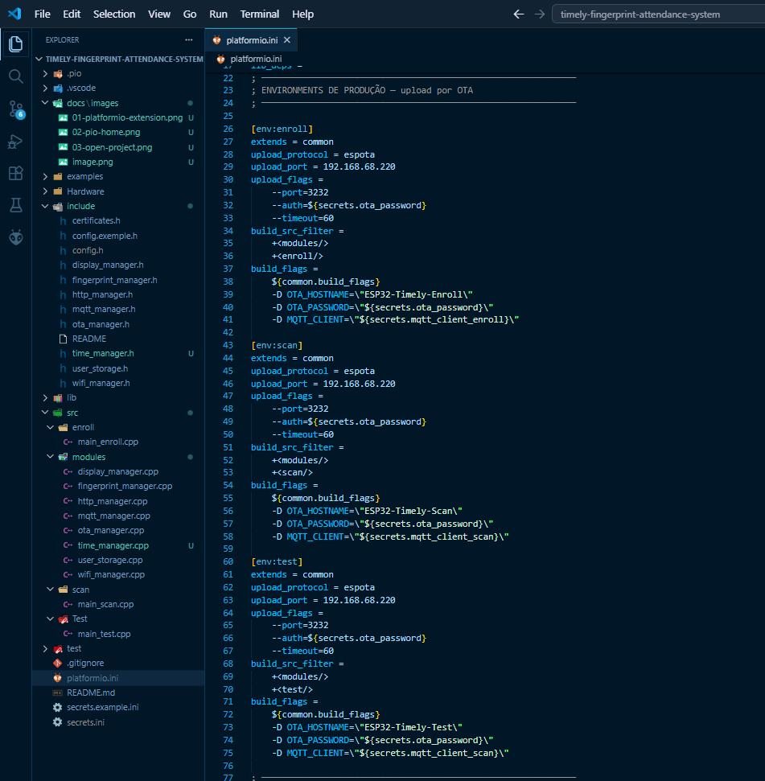

| Environment |                                Para que serve                                 | Variante por cabo |
|-------------|-------------------------------------------------------------------------------|-------------------|
| `enroll`    | Dispositivo de enrollment                                                     | `enroll-cable`    |
| `scan`      | Dispositivo de registo de ponto                                               | `scan-cable`      |
| `test`      | Código experimental ou ficheiros de `examples/` para despiste de erros e bugs | `test-cable`      |

**Quando usar cada um:**

- **`enroll`** — para o ESP32 que está na sala onde se registam novos utilizadores
- **`scan`** — para o ESP32 que está no controlo de acesso/ponto
- **`test`** — para experimentar código novo ou testar componentes isoladamente sem afectar a produção

**Variantes `-cable`:** usam a porta USB COM em vez de OTA. Necessárias no primeiro flash de cada ESP32 (antes do OTA estar funcional) ou em recuperação.

> ⚠️ **Aviso importante sobre o `MQTT_CLIENT`**
>
> Cada dispositivo na mesma rede MQTT precisa de um `MQTT_CLIENT` ID **único** — caso contrário o broker desliga as ligações duplicadas. Se quiseres testar enroll e scan no mesmo ESP32, ou se tiveres múltiplos dispositivos enrolados, edita o `build_flags` no `platformio.ini`:
>
> ```ini
> -D MQTT_CLIENT=\"${secrets.mqtt_client_enroll}\"
> ```
>
> Define IDs diferentes em cada environment para evitar conflitos.

---

## Mudar entre environments

Há duas formas de mudar entre environments no VS Code:

### Forma 1 — Barra azul inferior (mais rápida)

Na barra azul em baixo do VS Code, clica no nome do environment actual:

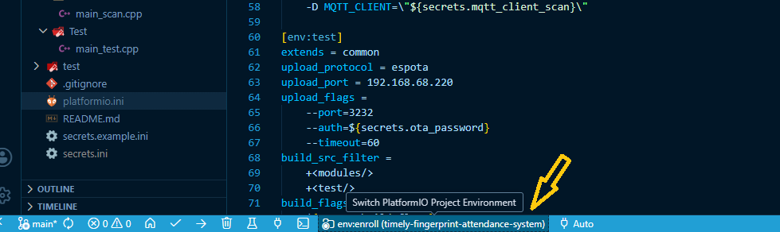

Aparece um dropdown com a lista de environments disponíveis:

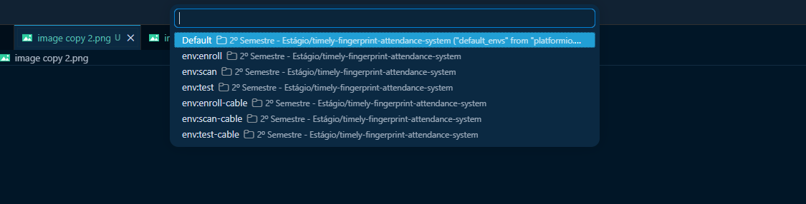

Selecciona o que queres e a partir daí todas as acções (Build, Upload, Monitor) usam esse environment.

### Forma 2 — PlatformIO sidebar (mais explícita)

Abre o painel da formiga na barra lateral. Em **Project Tasks** vês todos os environments listados, cada um com as suas acções (Build, Upload, Monitor, Clean, etc):

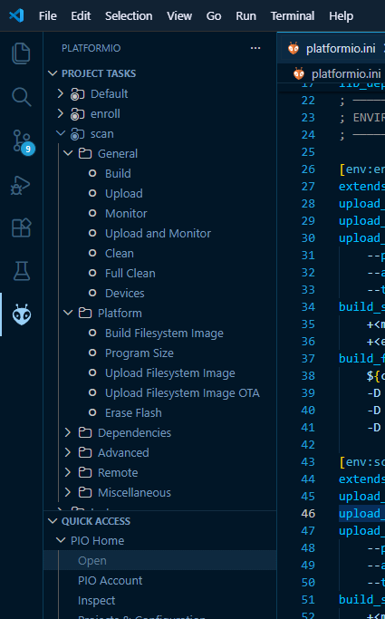

Cliques aqui executam imediatamente a acção para esse environment, independentemente do que está seleccionado na barra azul.

---

## Compilar e fazer upload

### Os três botões essenciais

Na barra azul em baixo encontras três ícones principais:

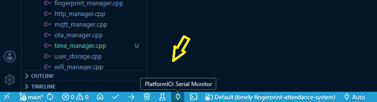

| Ícone |    Acção    |    Atalho    |               O que faz             |
|-------|-------------|--------------|-------------------------------------|
|   ✓   | **Build**   | `Ctrl+Alt+B` | Compila o environment seleccionado  |
|   →   | **Upload**  | `Ctrl+Alt+U` | Compila e envia para o ESP32        |
|  🔌   | **Monitor** | `Ctrl+Alt+S` | Abre o Serial Monitor a 115200 baud |

### Compilar

Selecciona o environment desejado e clica em ✓ (Build). O PlatformIO compila e mostra o resultado no terminal:

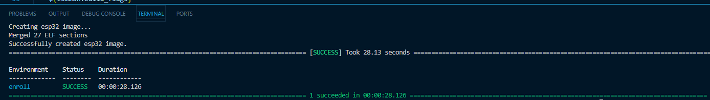

A linha **`[SUCCESS]`** confirma sucesso. Os valores de RAM e Flash mostram o uso de memória — para este projecto, valores normais ficam abaixo de 30% RAM e 50% Flash com o esquema de partições `min_spiffs.csv`.

### Upload por OTA (predefinido)

Por defeito, os environments `enroll`, `scan` e `test` fazem upload **via WiFi (OTA)** — não precisas de cabo USB.

**Requisitos:**
- O ESP32 deve estar ligado à mesma rede WiFi que o teu computador
- O firmware actual no ESP32 deve ter OTA activo (todos os firmwares deste projecto têm)
- O IP definido em `upload_port` no `platformio.ini` deve corresponder ao IP do ESP32

Selecciona o environment, clica → (Upload). O PlatformIO compila e envia via WiFi:

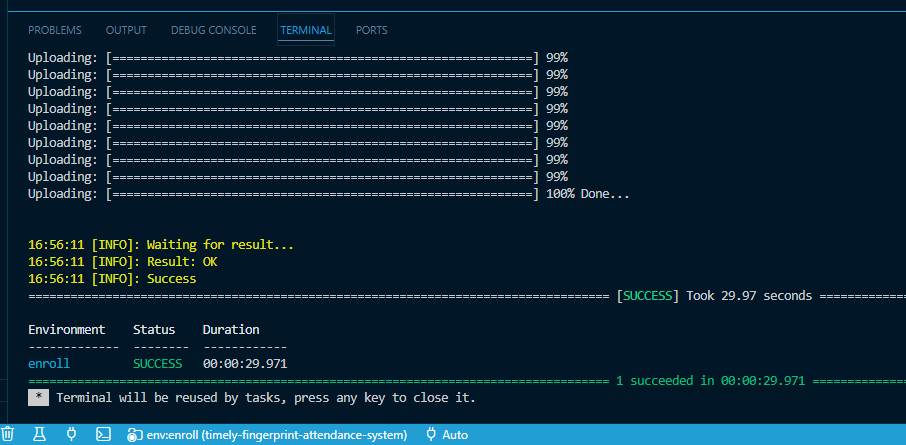

### Upload por cabo USB

Os environments terminados em `-cable` (`enroll-cable`, `scan-cable`, `test-cable`) usam **USB em vez de OTA**.

**Quando usar:**
- Primeiro flash de um ESP32 novo (sem OTA activo ainda)
- Recuperação após OTA falhado
- Quando o ESP32 não está acessível na rede

**Antes de fazer upload por cabo:**

1. Liga o cabo USB-C entre o ESP32 e o computador
2. No Windows, abre o Gestor de Dispositivos e vê em que porta COM aparece (ex: `COM3`)
3. No `platformio.ini`, ajusta a linha `upload_port = COM3` para a tua porta real

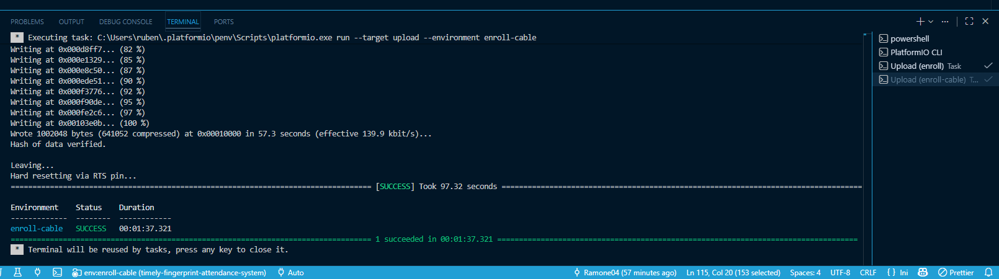

---

## Workflow típico

### Cenário A — Fazer alteração e actualizar produção

1. Edita o código no VS Code
2. Selecciona o environment (`enroll` ou `scan`) na barra azul
3. Clica ✓ Build para confirmar que compila sem erros
4. Clica → Upload — o ESP32 recebe o novo firmware via OTA
5. Clica 🔌 Monitor para ver o boot e validar que arranca correctamente

### Cenário B — Flashar um ESP32 novo

1. Liga o ESP32 ao computador via cabo USB-C
2. Confirma a porta COM no Gestor de Dispositivos
3. Edita `platformio.ini`, ajusta `upload_port` no environment `-cable` correspondente
4. Selecciona `enroll-cable` ou `scan-cable`
5. Clica → Upload
6. Após o primeiro flash bem sucedido, podes voltar a usar OTA para futuras actualizações

### Cenário C — Testar código experimental

1. Coloca o código a testar em `src/test/main_test.cpp`
2. Selecciona o environment `test` (ou `test-cable` se for o primeiro flash)
3. Build → Upload → Monitor

O `test` é o environment recomendado para **código experimental** ou para correr **sketches isolados da pasta `examples/`** quando precisas de despistar erros ou bugs sem afectar a produção.

---

## Troubleshooting

### "Could not find a version that satisfies..."

Apareceu durante o setup inicial? Verifica a tua ligação à internet — o PlatformIO precisa de descarregar o toolchain e as libs. Tenta novamente.

### Build falha com "fatal error: config.h: No such file or directory"

Não criaste o `include/config.h`. Vê o passo 5 do setup inicial.

### Upload OTA falha com "No response from device"

Verifica se:
- O ESP32 está ligado e na mesma rede WiFi que o teu computador
- O IP em `upload_port` do `platformio.ini` corresponde ao IP actual do ESP32 (vê no Serial Monitor após boot)
- Não há firewall a bloquear a porta 3232

Se o IP mudou, actualiza o `platformio.ini`. Como solução definitiva, o `wifi_manager` já usa IP estático — confirma se o `STATIC_IP` no `config.h` corresponde.

### Upload OTA falha a meio do progresso

Tipicamente é instabilidade WiFi na rede. Tenta:
1. Reiniciar o ESP32 (desliga e liga a alimentação)
2. Aproximar o ESP32 do router
3. Repetir o upload — tipicamente funciona na 2ª ou 3ª tentativa

Se persistir, faz upload por cabo (`-cable`) para recuperar.

### Upload por cabo falha com "Failed to connect to ESP32"

O ESP32 pode não estar em modo bootloader. Tenta:
1. Pressiona e mantém o botão BOOT do ESP32
2. Sem soltar, clica em Upload no VS Code
3. Quando vires "Connecting....." no terminal, solta o botão BOOT

### Serial Monitor mostra caracteres estranhos

Confirma que o baud rate do monitor é **115200**. O PlatformIO usa o valor do `monitor_speed` no `platformio.ini` — não deves precisar de mudar nada.

### LCD com caracteres estranhos no display

Pode ser interferência I2C. O `display_manager` faz re-inicialização periódica a cada 5 minutos para mitigar isto. Se acontecer com muita frequência, verifica:
- Soldaduras dos cabos SDA/SCL
- Tensão de alimentação do LCD (deve ser 5V estáveis)
- Adicionar pull-ups externas de 4.7kΩ nas linhas SDA e SCL

### MQTT desliga aleatoriamente

Verifica se o `MQTT_CLIENT` é único entre o enroll e o scan. Dois dispositivos com o mesmo client ID causam que o broker desligue um deles.

---

## Referências

- [PlatformIO Documentation](https://docs.platformio.org/)
- [Adafruit Fingerprint Sensor Library](https://github.com/adafruit/Adafruit-Fingerprint-Sensor-Library)
- [PubSubClient (MQTT)](https://github.com/knolleary/pubsubclient)
- [ArduinoOTA](https://github.com/jandrassy/ArduinoOTA)
- [HiveMQ Cloud](https://www.hivemq.com/mqtt-cloud-broker/)

---

## Licença

Projecto interno — propriedade da Mindshaker.